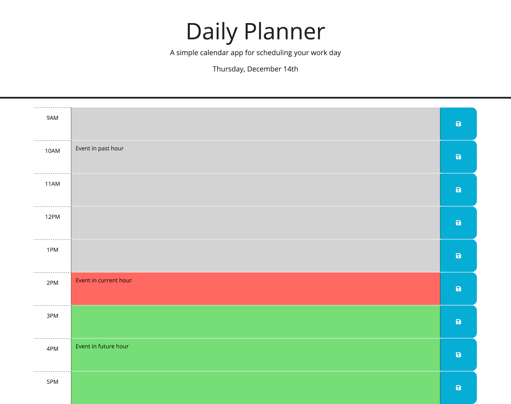

# Daily Planner

## Description

This project is a daily planner app that allows you to record what appointments and events that you have scheduled for the current day. The app displays the current date and displays a list of time blocks corresponding to each hour of the day, in which an event can be entered. Events can be saved to localStorage by clicking the save button to their right. The time blocks are colored depending on whether they represent the current hour, past hours, or future hours.

In addition to creating a planner app, this project allowed me to practice using third-party APIs in my code, including jQuery, Bootstrap, and day.js. One thing I learned while working on this project is how difficult times and dates can be to work with - there's just so many ways they can be formatted! Fortunately, we developers can rely on APIs and libraries, like day.js in this case, to provide important but difficult-to-implement functionality for us, so we can focus on the rest of the project.

## Installation

N/A

## Usage

To view the page, navigate to https://spencersurface.github.io/daily-planner in your web browser.

To save an appointment, click in the box corresponding to the hour of the appointment, type in the appointment, and then click the save button in the right of the box. To clear an appointment, erase the text in the desired box, then click the save button.

Here is a screenshot demonstrating how the page should appear: 

## Credits

This project consists primarily of code refactored from files provided by edX Boot Camps LLC. The index.html, style.css, and script.js files were provided. All modifications to these files were done by me. Additionally, I created this README and the screenshot of the completed app.

## License

No license at this time.